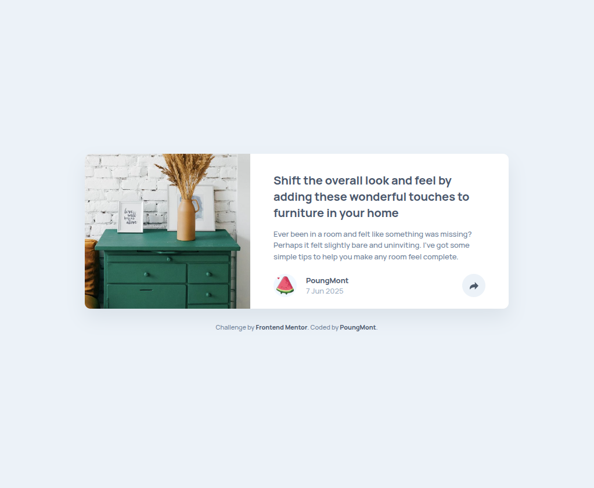
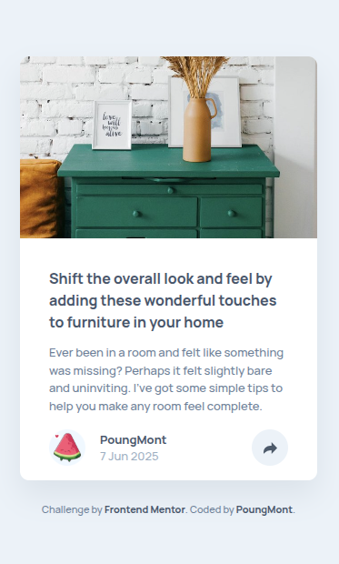
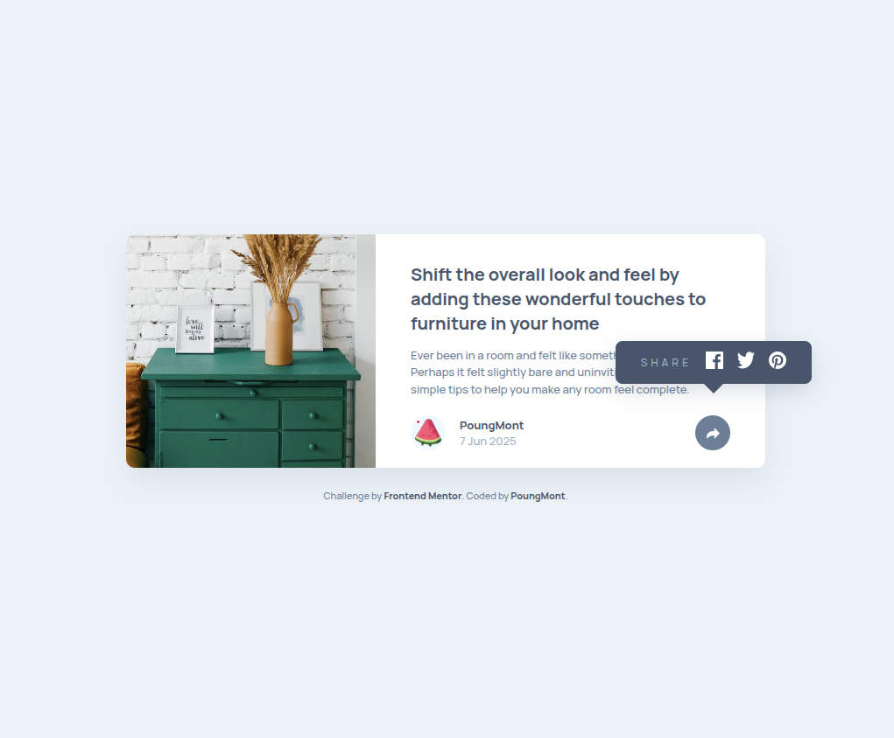
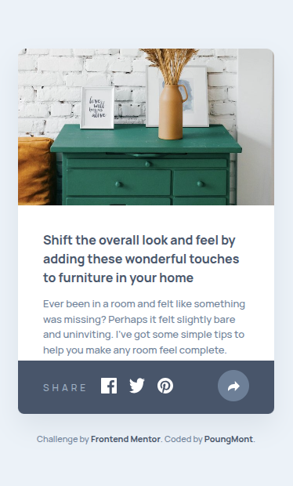

# Frontend Mentor - Article preview component solution

This is a solution to the [Article preview component challenge on Frontend Mentor](https://www.frontendmentor.io/challenges/article-preview-component-dYBN_pYFT). Frontend Mentor challenges help you improve your coding skills by building realistic projects.

## Table of contents

- [Overview](#overview)
  - [The challenge](#the-challenge)
  - [Screenshot](#screenshot)
  - [Links](#links)
  - [Built with](#built-with)
- [Author](#author)

## Overview

### The challenge

Users should be able to:

- View the optimal layout for the component depending on their device's screen size
- See the social media share links when they click the share icon

### Screenshot

| Desktop                                           | Mobile                                           |
| ------------------------------------------------- | ------------------------------------------------ |
|         |         |
| Desktop Active State                              | Mobile Active State                              |
|  |  |

### Links

> **LiveSiteUrl:** Article preview component on [GitHub Pages](https://thyuhtooaungowo.github.io/Article-preview-component/)

## My process

### Built with

- Semantic HTML5 markup
- CSS custom properties
- Flexbox
- CSS Grid
- Mobile-first workflow
- JavaScript

## Author

- Frontend Mentor - [@ThyuHtooAungOwO](https://www.frontendmentor.io/profile/ThyuHtooAungOwO)
- Twitter - [@PoungMont](https://x.com/Poung_Mont)
